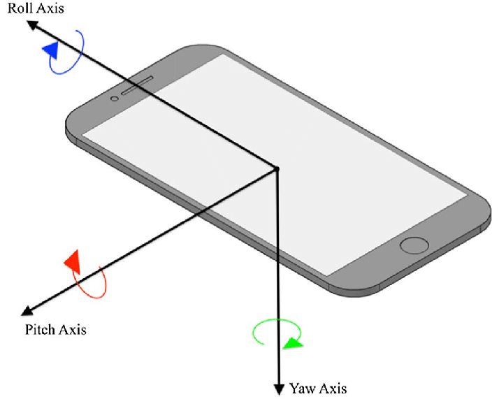

# Expo orientation sensor


Expo orientation sensor is a javascript library for  react native applications managed with expo.  
The purpose of this library is to keep track of the phone orientation by providing access to the three Euler Angles:  

* pitch
* roll
* yaw

(Look at [Orientation](#orientation))

This virtual sensor uses data form [Accelerometer][1], [Magnetometer][2] and [Gyroscope][3] fused together by [AHRS][4] (using Madgwick algorithm) to calculate the exact orientation

[1]: https://docs.expo.dev/versions/latest/sdk/accelerometer/ "Accelerometer"
[2]: https://docs.expo.dev/versions/latest/sdk/magnetometer/ "Magnetometer"
[3]: https://docs.expo.dev/versions/latest/sdk/gyroscope/ "Gyroscope"
[4]: https://github.com/psiphi75/ahrs "AHRS"

## Installation

`
npm install expo-orientation-sensor
`

## Usage

The usage of this package is very similar to the way you use [expo-sensors](https://docs.expo.dev/versions/latest/sdk/sensors/), with some extra functionalities

```tsx
import { Orientation } from 'expo-orientation-sensor'
```

```tsx
  const [angles, setAngles] = useState({
    yaw: 0,
    pitch: 0,
    roll: 0,
  })
  useEffect(() => {
    const subscriber = Orientation.addListener(data => {
      setAngles(data)
    })
    return () => {
      subscriber.remove()
    }
  }, [])
```

This code should update state `angles` every time new measurements are available

### Note

You don't have to keep track of all updates, you can call `Orientation.getEulerAngles` and it will return the latest angles measured.  
Keep in mind that if there are no listeners added by `Orientation.addListener`, or all listeners have been removed The angles will **NOT** be updated

## Demo

[snack.expo.dev](https://snack.expo.dev/@firstdev/expo-orientation-sensor-demo)

## Orientation

The image below the pitch, roll and yaw axis and their positive direction



The three axis are fix to the phone reference

## Documentation

`Orientation.eulerAngles`

Returns the latest angles measured.

*Note: the angles returned might outdated if no listeners are set*.

`Orientation.isAvailableAsync()`

Returns whether this sensor is available on the device.  
*Should be true if Accelerometer, Magnetometer and Gyroscope are available*.

`Orientation.addListener()`

Subscribe for updates to the orientation.  

*Arguments*:

* **listener (function):** A callback that is invoked when an orientation update is available. When invoked, the listener is provided with the current euler angles.

*Returns*:

* A subscription that you can call `remove()` on when you would like to unsubscribe the listener.

`Orientation.removeAllListeners()`

Remove all listeners.

`Orientation.setUpdateInterval()`

Subscribe for updates to the orientation.  
*Arguments*

* **intervalMs (number):** Desired interval in milliseconds between gyroscope updates.

`Orientation.hasListener`

Return a boolean indicating whether there is at least a listener.

`Orientation.listenerCount`

Returns how many listeners are subscribed.
